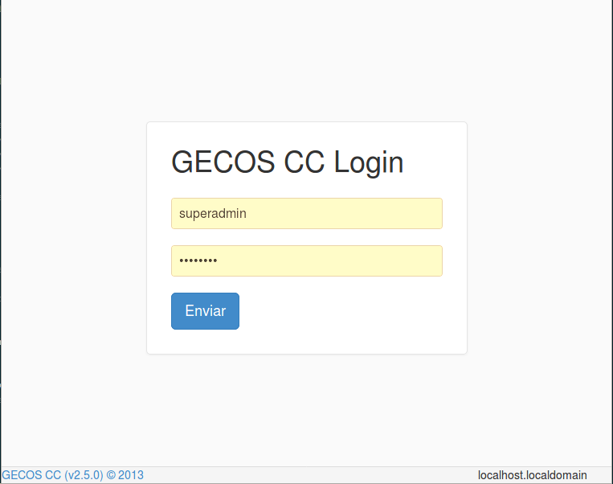

# gecoscc-installer

Script and configuration templates to install a __GECOS Control Center__.

## Minimum requirements

* In order to get __GecosCC__ installed, your server should have, at least, __4GB of RAM memory__ in a real or virtual server.

* __GecosCC__ has been developed for CENTOS 6.x minimal (64bits) and it should have a right FQDN and internet access.

## Installation instructions

1. From your `root` account (or some other user with privileges), you have to download the installer from `http://bit.ly/gecoscc-installer`.
~~~
curl -L http://bit.ly/gecoscc-installer > gecoscc-installer.sh
~~~

1. Edit the installer and change the variables `ORGANIZATION_NAME`, `ADMIN_USER_NAME` and `ADMIN_EMAIL`.
~~~
ORGANIZATION="Your Organization"
ADMIN_USER_NAME="superuser"
ADMIN_EMAIL="gecos@guadalinex.org"
~~~

1. Run the installer.
~~~
bash gecoscc-installer.sh
~~~

1. You have to install all the components in the menu, in the order specified:
	1. Chef
	2. MongoDB
	3. nginx
	4. GecosCC

 Please, note that after installing every piece of software, `gecoscc-installer.sh` will exit to the command line and you will have to run the script again.

1. After install __GecosCC__ is mandatory restart the server.
~~~
shutdown -r now 'restarting after install gecosCC'
~~~

## Configuration

1. You have to run the installer, again, for creating an administrator user (`USER` option in the menu) and give all rights (`SET_SUPERUSER` in the menu).
~~~
bash gecoscc-installer.sh
~~~

1. Select `USER` to create your first superuser but remember that you can create more admins from the web interface. This command will show some messages with important data like your superadmin password. Do not forget to write it down!

1. Now you should be able to log in into your brand new __Gecos Control Center__, using your favorite web browser. Just point it to your server's IP address.

Once you reach into your Control Center you can finish the configuration process, installing policies, printers and packages.

1. Run the installer, once more.
~~~
bash gecoscc-installer.sh
~~~

1. Execute the options that feed the system with:
	1. `POLICIES`. It will download and install last version of workstation policies.
	2. `PRINTERS`. It will download and install a catalogue with +4000 printer models.
	3. `PACKAGES`. It will download and install a huge catalogue of software to install in your workstations.

 You can repeat these steps as many times as you need.

